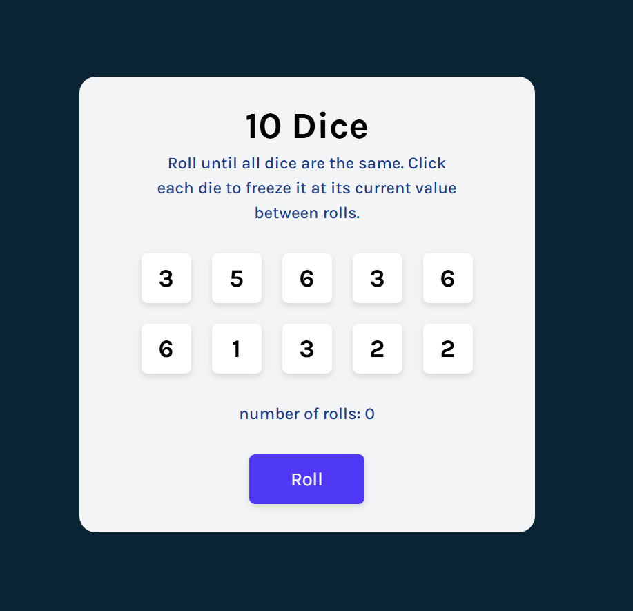
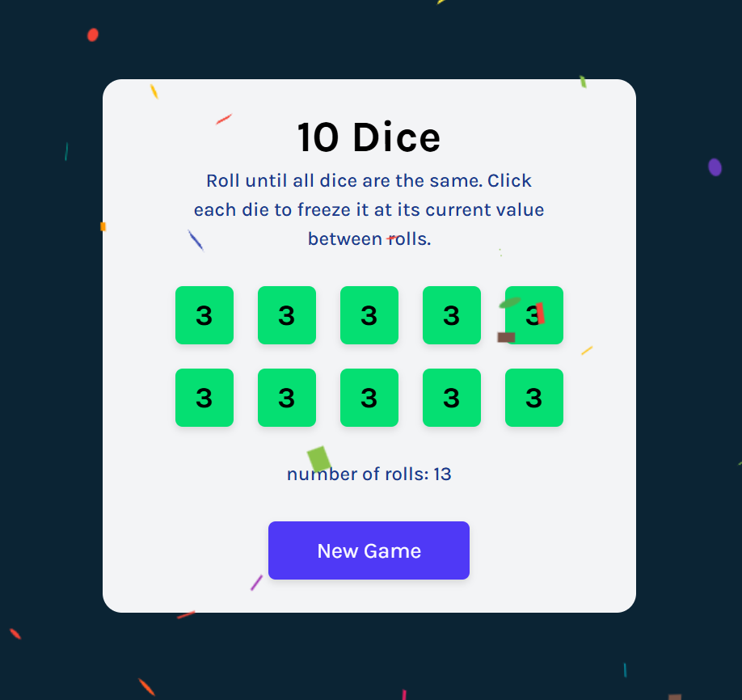

#  10 Dice Game

A simple dice game built with **React**, where the goal is to roll until all dice show the same value.

---

##  Features

-  Roll 10 dice at once
-  Click a die to hold or release it
-  Play again without refreshing
-  Displays the number of rolls

---

##  Technologies Used

- [React](https://react.dev/)
- [Tailwind CSS](https://tailwindcss.com/)
- [nanoid](https://www.npmjs.com/package/nanoid)
- [react-confetti](https://www.npmjs.com/package/react-confetti)

---

##  Screenshots

  
  

